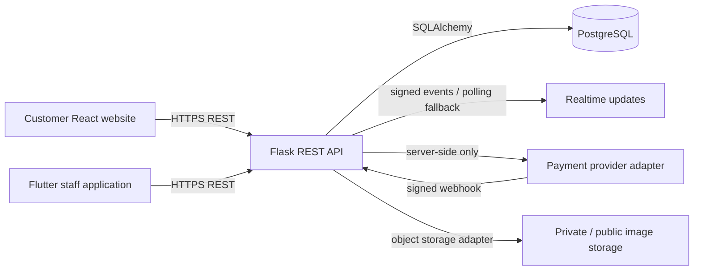
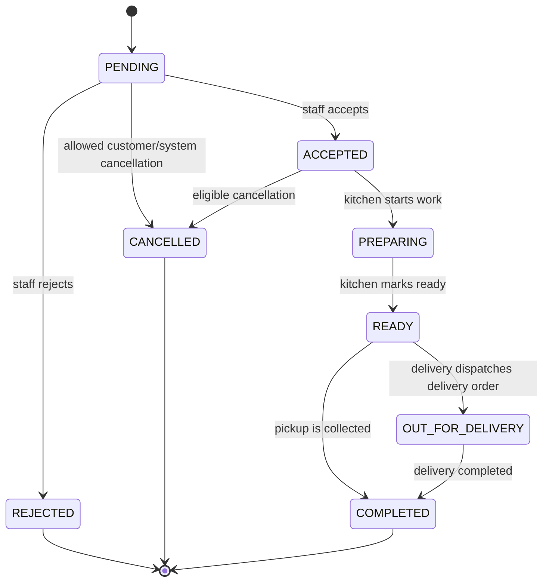

# THE HAROLD'S PLACE Ordering Platform — Architecture

## Purpose and boundaries

This product is a connected ordering platform consisting of a customer-facing React website, a Flask REST API, PostgreSQL persistence, and a dedicated Flutter staff application. The customer web project is maintained separately at `/home/ubuntu/harolds-place-ordering`; this repository holds the portable Flask backend, Flutter source, Docker development setup, API documentation, and tests. It is intentionally nested under `harolds_place/` so it does not overwrite the unrelated Draken Industries API already present at the repository root.

Public research has established a Port Harcourt / Igrita context, a hospitality-oriented brand voice, public social profiles, and owner-confirmation phone details. It has **not** established a reliable menu, prices, delivery fee, authoritative schedule, payment account, legal identity, or operational policy. The system must therefore start with no menu records and expose explicit configuration flows instead of synthesizing business data.

## Delivery topology

The website must never receive a payment secret, database credential, staff privilege, or storage administration credential. The Flutter application and website use the same REST API and database; staff-only operations are protected in the API, not merely hidden by UI controls.

## Deployment choices still requiring an owner decision

The codebase is portable and includes Docker Compose for local development. A Python-capable host is still required for the Flask service and an accessible PostgreSQL database before the backend can be made live. The static customer website can be hosted separately from the API, provided `VITE_API_BASE_URL` points to the deployed HTTPS API.

| Approach | Trade-offs | Cost | Setup complexity |
| --- | --- | --- | --- |
| Static website preview plus Docker Compose backend for local owner demonstration | Fastest way to validate flows and configure real restaurant data; staff devices must reach the local API and payments/webhooks cannot be live. | Infrastructure-dependent; no payment-provider commitment. | Moderate. |
| Static website plus managed Python/PostgreSQL deployment | Supports public ordering, payment callbacks, and staff access; requires domain, TLS, secure environment variables, database backups, and operational monitoring. | Provider-dependent. | Higher. |

No production deployment is assumed or performed until the restaurant owner supplies the required business, payment, storage, and hosting configuration.

## Trust model and roles

Customer accounts are distinct from staff accounts. Passwords are stored only as strong hashes; access tokens are short-lived JWTs with a refresh strategy suitable for the deployment. The API validates authorization on every protected action.

| Role | Server-enforced permissions |
| --- | --- |
| `OWNER` | Full restaurant configuration, staff management, menu management, orders, customers, analytics, and operating status. |
| `MANAGER` | Orders, menu, customers, basic analytics, and selected operating settings. |
| `KITCHEN` | Read assigned/new orders and advance them only through food-preparation states. |
| `DELIVERY` | Read assigned delivery orders and advance delivery progress only. |
| `CUSTOMER` | Manage own profile, addresses, carts at the client, and own orders only. |

The backend owns permission checks. A client-provided role, restaurant ID, payment status, price, delivery fee, or order total is never trusted.

## Relational model

All identifiers are UUIDs. Monetary amounts use integer minor units (kobo) with an explicit `currency` field, preventing floating-point currency errors. All business timestamps are UTC. The schema uses foreign keys, `created_at`/`updated_at`, and indexes on frequent lookup paths.

| Area | Core tables | Notes |
| --- | --- | --- |
| Identity and access | `users`, `staff_profiles`, `refresh_tokens` | `users.role` is limited to the defined application roles. Staff profile rows are tied to a restaurant. |
| Restaurant configuration | `restaurants`, `restaurant_settings`, `business_hours` | All public contact, opening, pickup, delivery, fee, minimum-order, branding, and operating values are configurable. No public research result is treated as final. |
| Menu | `categories`, `menu_items`, `menu_item_options`, `menu_item_option_values`, `menu_item_images` | Menu starts empty. Items and categories use archival state rather than hard delete. Availability and prep time are independently configurable. |
| Customer data | `addresses`, `customer_preferences` | Only order-relevant information is retained. Address data belongs to the customer and is never exposed to other customers. |
| Orders | `orders`, `order_items`, `order_item_options`, `order_status_history` | Order line items snapshot menu name, unit price, and choices when submitted so later menu edits do not alter the order record. |
| Payments | `payments`, `payment_events` | Provider reference is unique. Raw provider payloads are stored only where necessary and redacted from logs. |
| Notifications | `notifications`, `device_tokens` | Delivery endpoints and device tokens are opt-in/configured; failures are observable but must not block an order. |

### `orders` invariants

`orders` stores the restaurant reference, optional authenticated customer reference, fulfilment mode, customer contact snapshot, address snapshot when delivery is selected, internal/customer notes, monetary totals, payment status, version number, and all status-transition timestamps. The API recalculates totals from the server-side menu snapshot and rejects any unavailable item, closed restaurant, invalid fulfilment setting, or expired cart before accepting an order.

## Order state machine

The API implements transitions, records their timestamps, and rejects arbitrary rewrites.

`OUT_FOR_DELIVERY` is invalid for pickup orders. `COMPLETED` is invalid until pickup is ready or delivery is dispatched. Actors, timestamps, order version, optional staff ID, and an audit note are captured in `order_status_history` for every transition.

## REST API shape

The API uses JSON, ISO 8601 timestamps, explicit pagination, and a consistent error envelope: `{ "error": { "code": "...", "message": "...", "fieldErrors": {} } }`. Success and client errors never expose stack traces. Each write accepts an idempotency key, and order/payment operations persist the key to prevent duplicate submissions.

| Area | Primary operations |
| --- | --- |
| Auth | `POST /api/v1/auth/register`, `POST /api/v1/auth/login`, `POST /api/v1/auth/refresh`, `POST /api/v1/auth/logout`, `GET /api/v1/me` |
| Customer menu | `GET /api/v1/restaurant`, `GET /api/v1/menu`, `GET /api/v1/menu/categories`, `GET /api/v1/menu/items/{item_id}` |
| Customer account | `GET/PATCH /api/v1/profile`, `GET/POST/PATCH/DELETE /api/v1/addresses` |
| Customer orders | `POST /api/v1/orders`, `GET /api/v1/orders`, `GET /api/v1/orders/{order_id}`, `POST /api/v1/orders/{order_id}/cancel` |
| Payments | `POST /api/v1/payments/initialize`, `POST /api/v1/payments/verify`, `POST /api/v1/payments/webhook/{provider}` |
| Staff orders | `GET /api/v1/staff/orders`, `GET /api/v1/staff/orders/{order_id}`, `PATCH /api/v1/staff/orders/{order_id}/status` |
| Staff menu | `GET/POST/PATCH /api/v1/staff/categories`, `GET/POST/PATCH /api/v1/staff/menu-items`, `POST /api/v1/staff/menu-items/{item_id}/images` |
| Staff operations | `GET /api/v1/staff/dashboard`, `GET /api/v1/staff/customers`, `GET /api/v1/staff/analytics`, `GET/PATCH /api/v1/staff/settings` |

## Payment contract

Payments are implemented behind an adapter so Paystack can be configured by environment variables without coupling order logic to a single vendor. `PAYSTACK_SECRET_KEY`, `PAYSTACK_PUBLIC_KEY`, callback URL, and webhook path are never committed. Before creating an order that needs online payment, the backend computes the final amount and initializes a provider transaction. A client return URL can request a verification attempt, but only a server-side provider verification can set `payments.status = SUCCEEDED`.

Paystack’s current documentation recommends webhooks as the preferred confirmation method, requires a server-side verification request by transaction reference, and states that payment webhooks carry an `x-paystack-signature` HMAC-SHA512 signature created with the secret key.[1] [2] The webhook handler must read the unmodified request payload, compare the signature in constant time, persist the event idempotently, verify the provider reference server-side, then update payment/order state in one transaction. A successful browser redirect alone must never mark a payment successful.

In this initial product, provider configuration is absent. The UI must show only payment options that the restaurant has enabled. It can support an owner-configured pay-on-pickup/pay-on-delivery route without falsely representing it as a successful card payment.

## Realtime and notifications

The production target uses Flask-SocketIO or a standards-compatible Server-Sent Events endpoint backed by PostgreSQL/Redis-compatible fanout, selected by deployment capability. Order status changes are written first, then an event carrying the order ID and monotonic version is published. The customer client listens only to its own order channel; staff clients listen to their restaurant channel after authorization. The REST order endpoint remains authoritative and is used to recover from reconnects, unavailable network, or missed events. No customer or staff screen fabricates live behaviour.

New-order push delivery is an optional adapter. Firebase Cloud Messaging device credentials and service configuration are not present, so the Flutter client will include a secure device-token registration seam and honest “notifications require configuration” state. The product must work without push notification configuration.

## Storage and uploads

The backend validates MIME type, content signature, file size, and ownership before accepting an image. It strips untrusted filenames, generates a server-side storage key, and returns only a safe public/authorized URL. Deleting menu images is archival unless business retention policy is confirmed. Without a configured storage provider, image upload remains unavailable with a human-readable administrative message; no broken placeholder upload is presented as working.

## Security and operations baseline

The portable backend includes CORS allow-list configuration, secure password hashing, JWT expiry, token revocation, request validation, server-side pricing, SQLAlchemy parameterization, rate limits for auth and payment endpoints, structured logs with secret redaction, webhook signature verification, upload validation, and `.env.example` files. Migrations are mandatory and must run before the service exposes a ready health check. Local development uses Docker Compose; production readiness remains false until database, CORS, JWT, payment, storage, and notification variables are configured.

## Configurable facts register

| Field | Initial value | Required action before live ordering |
| --- | --- | --- |
| Restaurant name | `THE HAROLD'S PLACE` | Confirm legal / customer-facing spelling. |
| Location | Empty value with public listing notes | Owner confirms address and map destination. |
| Customer phone | Empty value with two discovered candidates | Owner selects/enters active ordering contact number. |
| Operating status and hours | Closed / unconfigured in data model | Owner configures actual service schedule. |
| Menu / prices / options | No records | Owner adds and approves live menu. |
| Pickup / delivery / fee / minimum | Disabled / unconfigured | Owner sets applicable policies. |
| Payment provider | Disabled | Owner supplies verified sandbox/live account configuration. |
| Legal documents | Generic, confirmation-needed templates only | Owner obtains legal/business review. |

## References

[1]: https://paystack.com/docs/payments/webhooks/ "Paystack Webhooks"
[2]: https://paystack.com/docs/payments/verify-payments/ "Paystack Verify Payments"
